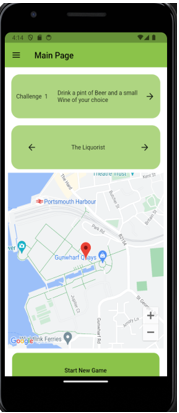
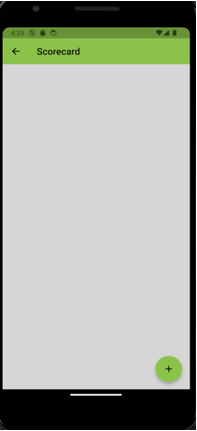
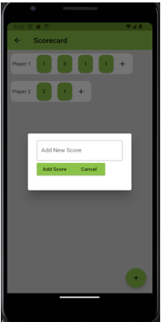
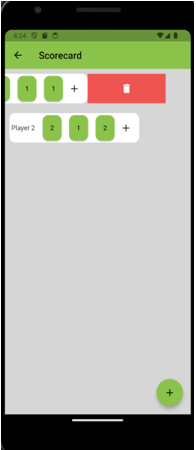
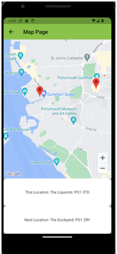

# ⛳ Pub Golf App

## Overview

The **Pub Golf App** is a mobile application inspired by the popular social drinking game *Pub Golf*. It streamlines the organization and gameplay by generating a route of 9 different pubs or bars across Portsmouth, along with a unique set of 9 challenges for players to complete. The app handles player management, scoring, and route generation, making it easier than ever to enjoy a fun and competitive night out.

> ⚠️ Currently, the app is localized to **Portsmouth** and includes a limited number of predefined locations and challenges.

---

## ✨ Features

- Generate a route of 9 pubs in Portsmouth
- Randomly assign 9 different challenges per game
- Manage player names and scores
- Edit or delete individual player scores
- Create a new game at any time (resets all game data)
- Navigate through the challenges and locations
- View current and next location using **Google Maps**
- All data stored locally using Hive

---

## 🛠️ Technologies Used

- **Language**: Dart
- **Framework**: Flutter
- **Packages**:
  - [`flutter`](https://flutter.dev/)
  - [`hive`](https://pub.dev/packages/hive) - local storage
  - [`google_maps_flutter`](https://pub.dev/packages/google_maps_flutter) - map functionality
  - [`flutter_slidable`](https://pub.dev/packages/flutter_slidable) - swipe actions

---

## 📱 App UI Structure

### 🏠 Main Page

- **App Bar**: Displays the page title and navigation drawer
- **Challenge Container**: Shows challenge number, description, and navigation button
- **Location Container**: Shows current location with next/previous navigation
- **Google Maps Container**: Displays current location marker
- **New Game Button**: Starts a new game with a new route and challenge set

### 📝 Scorecard Page

- **Initial View**: Player list and scores displayed on first app load
- **Add Player**: Floating action button launches dialog for player name input
- **Edit Scores**: Tap individual scores to update via a dialog box
- **Slidable Player Rows**: Swipe to delete players
- **Horizontal Scroll**: View all scores across the 9 locations
- **Navigation**: App bar allows return to main screen

  

### 🗺️ Map Page

- Larger Google Maps view
- Current and next locations are displayed with corresponding postcodes
- “End of Route” is shown when the final destination is reached

- 

---

## 🔁 Core Functions

### Main Page
- `initState()`: Initializes the app
- `nextChallenge()`: Moves to the next challenge
- `setLocations()`: Sets current and next locations
- `getNextLocation()`: Moves to next location and updates state
- `getLastLocation()`: Moves to previous location and updates state
- `createNewGame()`: Resets all game data and creates a new route/challenge set

### Scorecard Page
- `addNewPlayer()`: Dialog to input new player
- `savePlayer()`: Saves new player to app state
- `removePlayer()`: Deletes player from scorecard
- `addNewScore()`: Dialog to input score
- `editScore()`: Edits existing player score
- `saveEditedScore()`, `saveScore()`: Save updates from dialogs

### Database
- `createNewGame()`: Clears old data, calls `createNewRoute()` and `createNewChallengeSet()`
- `getData()` / `setData()`: Read/write from Hive storage
- `createNewRoute()`: Generates and stores new route
- `createNewChallengeSet()`: Generates and stores new challenges

---

## 🚀 Future Development

- **Cloud Syncing** for multi-device and multi-user access
- **Team Mode** support for group competition
- **Non-Alcoholic Challenge Options**
- **Dynamic Routing** for cities beyond Portsmouth
- **Event Integration** for use in social and corporate events
- **Monetization** via:
  - Pub/bar advertising
  - Subscriptions for commercial event hosts

---

## 💡 Use Cases

- University freshers events
- Corporate team-building activities
- Pub crawls for friend groups
- Social mixers
